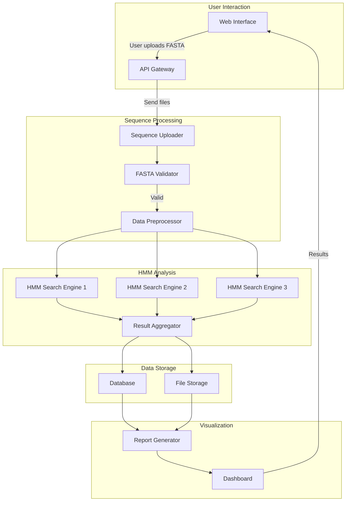

# HMZyme - Microservices for Gene Search in Biogeochemical Cycles

## 🧬 Overview

HMZyme is a cutting-edge microservices-based system designed to **decode the genetic blueprint of biogeochemical cycles**. By leveraging powerful **HMM-based analysis** and integrating data from **METABOLIC, KEGG, PFAM, and TIGR**, HMZyme enables researchers to rapidly and accurately **identify genes in protein sequence FASTA files.**

---

## Why HMZyme?

### **Precision at Scale:** 
HMZyme employs highly optimized Hidden Markov Models (HMMs) to deliver unparalleled gene annotation accuracy.

### **Microservices Architecture:** 
Scalable, modular, and high-performance infrastructure designed for bioinformatics workloads.

### **Biogeochemical Cycle Insights:** 
A powerful tool for studying microbial communities, ecosystem health, and environmental sustainability.

### **Seamless Integration:** 
Supports multiple bioinformatics databases and APIs, making it adaptable to research and industry needs.

---

## Use cases?

**Microbial Ecology & Environmental Research:** Identify genes involved in carbon, nitrogen, sulfur, and phosphorus cycles.

**Metagenomic Studies:** Annotate and classify proteins from environmental sequencing data.

**Biotech & Pharma Applications:** Discover functional genes for industrial and medical biotechnology.

**Custom Gene Discovery Pipelines:** Integrate HMZyme into existing bioinformatics workflows.

---

## HMZyme as a Product & Service

We are not just building a tool; we are shaping the future of bioinformatics-driven sustainability. HMZyme will be available as:

### 1. **HMZyme Cloud (SaaS)**

🔹 Web-based platform for FASTA sequence analysis.

🔹 Automated annotation pipeline with real-time results.

🔹 Subscription-based pricing with API access.

### 2. **HMZyme On-Premise (Enterprise License)**

🔹 Deployable software for research labs and biotech firms.

🔹 High-performance local processing for sensitive data.

🔹 Annual licensing with enterprise support.

### 3. **HMZyme API**

🔹 Pay-per-use API for seamless integration with existing bioinformatics platforms.

🔹 Enables developers to incorporate gene annotation into custom applications.

### 4. **Consulting & Training Services**

🔹 Custom bioinformatics analysis for industry and academia.

🔹 Workshops & certification programs on HMM-based gene annotation.

---

## 🎯 **Features**

✅ **Upload & validate FASTA files**\
✅ **Preprocess sequence data**\
✅ **Run HMM searches on distributed workers**\
✅ **Store results in a database**\
✅ **Generate reports for analysis**\
🧑‍🌾 **(In Progress) Interactive Dashboard for visualization**\
🧑‍🌾 **(In Progress) API Gateway for unified service communication**\
🧑‍🌾 **(In Progress) Optimized load balancing between HMM search workers**

---

## 🔹 **System Architecture**

---

## 🏰 **Project Status**

### ✅ **Completed**

- **Sequence Uploader**: Handles file uploads and storage.
- **FASTA Validator**: Ensures correct format before processing.
- **Data Preprocessor**: Prepares sequences for HMM-based search.
- **HMM Search Engine Workers**: Process sequences using KEGG, METABOLIC, PFAM, and TIGR models.
- **Result Aggregator**: Combines results from multiple HMM searches.
- **Database & File Storage**: Stores processed sequences and search results.
- **Report Generator**: Creates readable reports.

### 🛠 **In Development**

- **Interactive Dashboard**: Visual representation of analysis results.
- **API Gateway**: Unified entry point for external requests.
- **Load Balancing**: Optimize worker distribution for HMM search.

